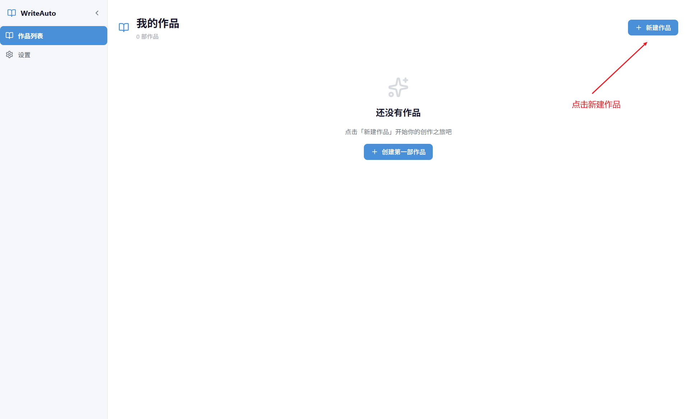
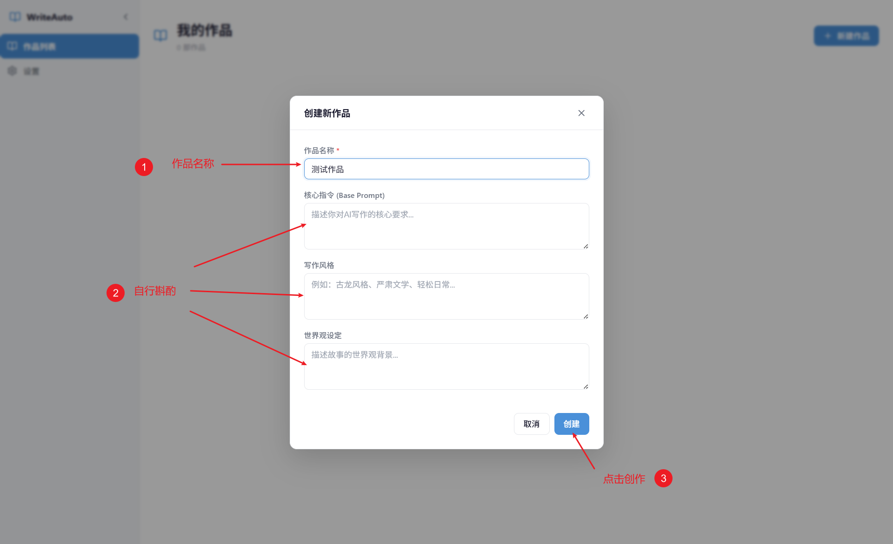
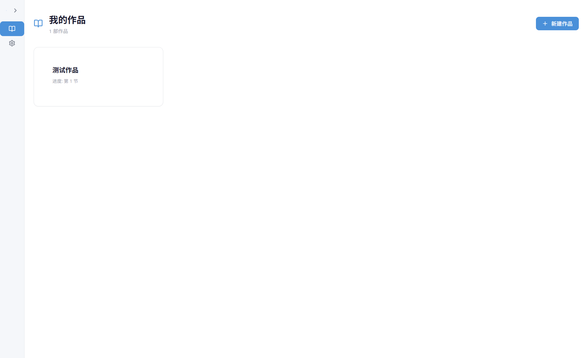
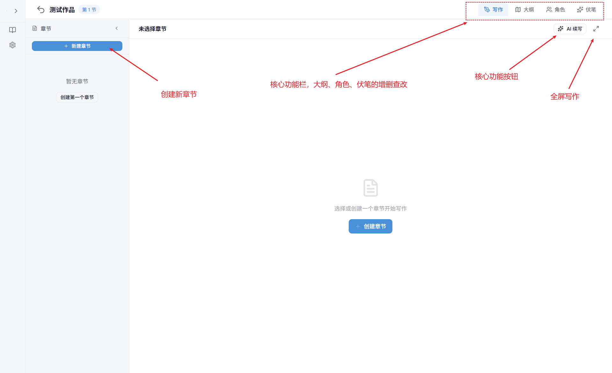
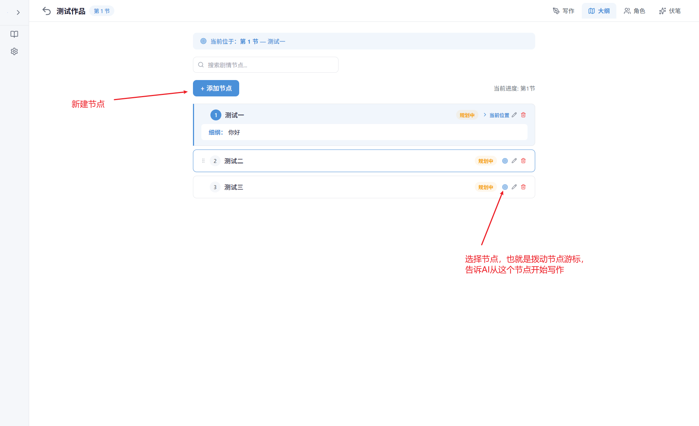
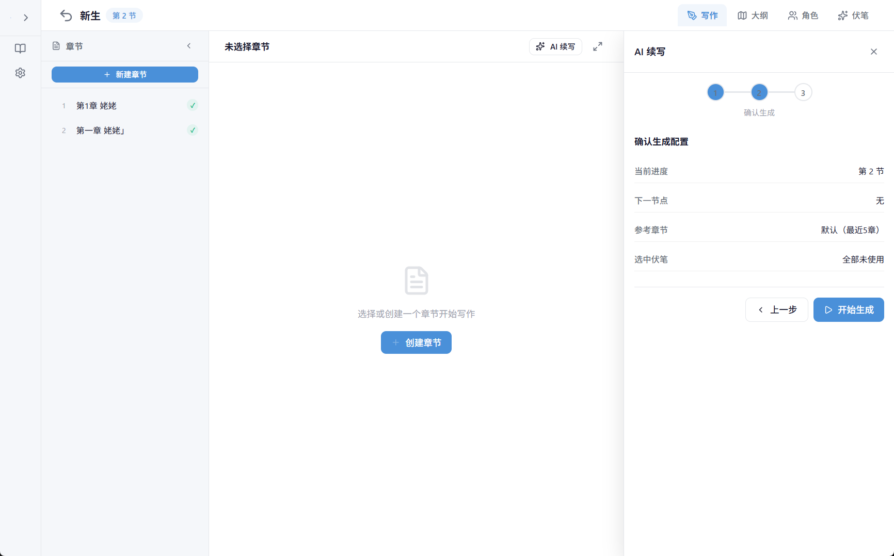
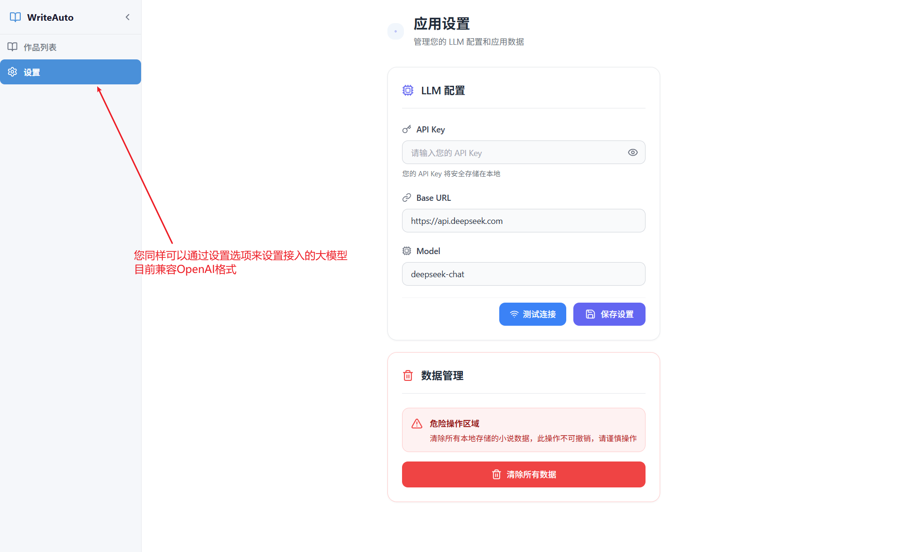
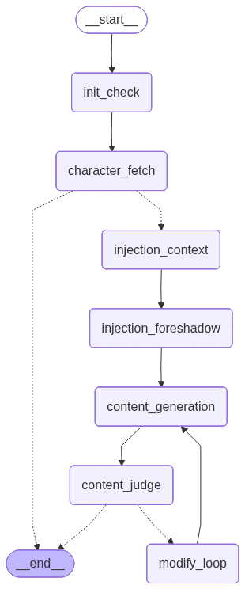

# WriterAuto

### 项目介绍

该项目的核心是基于LangGraph框架的图API模式搭建的Agent流程，开发语言使用Python，包管理工具使用uv，前端部分使用Vue框架，前后端通信通过FastAPI和pywebview，最后经由pyinstaller打包。

相比于同类型的AI辅助小说创作项目，这个项目有一个创新点：剧情游标

什么是剧情游标呢？首先我们规定：

如何编写大纲？在本项目中，大纲由一组最小不可分剧情单元节点串行化组成，也就是说每一个node（节点）都是AI在创作时的最小的、不能够再次细分的剧情单元，我们在指挥AI续写的时候，可以手动拨动剧情游标来指挥AI进行特定剧情节点的创作。

基于上述信息，我们可以确定，所谓的游标就是指向特定剧情节点的一个指针，它告诉AI在创作时从这个剧情节点开始，用于指明AI需要创作的内容及其范围。

> 如果您对本项目有任何好的建议欢迎提Issue，如果您觉得这个项目还算不错的话希望您能点点star。不管是Issue还是star，都是对于开发者而言宝贵的认可哦。
>
> 同时，热烈欢迎各位大佬fork本项目，个人的精力和能力都是有极限的，我实在没有本事一个人就做出来功能、体验都在线的应用。

### 项目启动

本项目有两种使用方式：

1. 基于pyinstaller打包后的版本，我在本仓库中上传了Windows平台的exe可执行文件。
2. 直接启动项目，使用uv作为依赖管理，首先构建前端代码`cd .\frontend`、`npm run build`随后下载必要Python依赖后，直接运行`uv run .\main.py`启动项目，当然，你也可以使用`uv run .\main.py --dev`运行后台版本然后直接在你的浏览器中访问`http://127.0.0.1:21278`进入应用界面或者`http://127.0.0.1:21278/docs`查看API文档。

值得注意的是，项目的原理是在本地启动一个FastAPI服务，所以哪怕你运行pyinstaller打包后的版本也可以正常通过浏览器访问页面和接口文档。

### 功能模块介绍

**进入首页新建作品**

**小说创作页**

**用户生成核心页**

**用户设置**

### 核心LangGraph工作流程

